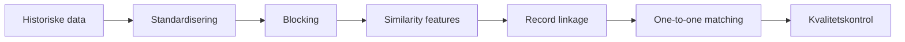
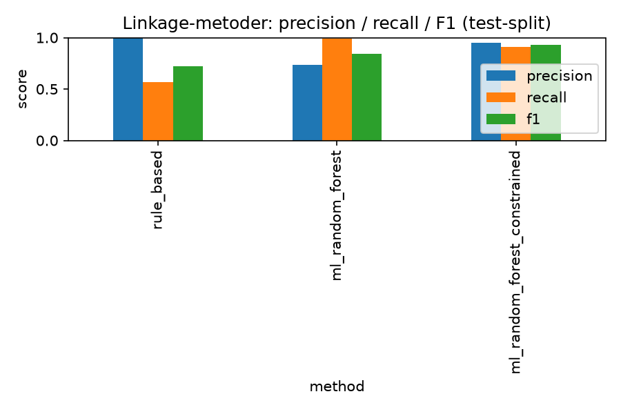

# Historical Record Linkage Lab

Et portfolio-projekt i historisk record linkage: at afgøre, hvornår
støjfyldte, transskriberede poster - uden CPR-nummer og med navne der
kolliderer - beskriver samme person. Demonstreret på et syntetisk
benchmark og et ægte historisk OCR-datasæt.

**Selvstændigt lærings-/portfolio-projekt** - ikke udviklet af eller for
Rigsarkivet, og bruger ingen HisPeR-data.

## Pipeline



*Samme seks trin kører for både det syntetiske datasæt og NYC-directory-casen, med skema-specifikke moduler under trin B-D.*

- **Standardisering** – renser navne/erhverv/adresser uden at fjerne information, der er nyttig til kobling.
- **Blocking** – reducerer kandidatpar med over 99 %, så vi ikke sammenligner alle poster med alle.
- **Similarity features** – Jaro-Winkler-similaritet på navn, erhverv, adresse, fødselsår m.m.
- **Record linkage** – regelbaseret og ML-klassifikation af kandidatpar.
- **One-to-one matching** – sikrer at én post kun kan matche én anden post.
- **Kvalitetskontrol** – sanity checks der flager modstridende eller usandsynlige koblinger.

Se [docs/architecture.md](docs/architecture.md) for den fulde metodik.

## Data

- **Syntetisk benchmark:** genereret census + kirkebogsdata (4.000 individer) med kontrolleret støj og kendt facit.
- **Real-world case study:** 8.000 OCR-baserede records fra NYPL's Doggett's New York City Directory, 1851/52 (hentet fra NYPL's officielle GitHub, MIT-licens).

NYC-datasættet bruges som real-world case study **uden komplet ground
truth** - der findes intet facit-felt for "samme person" i kildedata, så
evalueringen bygger på et lille, manuelt vurderet benchmark (92 par). Se
[docs/dataset_selection_notes.md](docs/dataset_selection_notes.md).

## Metoder

- Rule-based linkage (faste similaritets-tærskler)
- Random Forest-klassifikation
- One-to-one constrained graph matching (`networkx.max_weight_matching`)
- Eksperimentel LLM-assistance via Ollama/Llama 3.2 - **implementeret, men ikke kørt** i dette miljø (Ollama er utilgængeligt her, se begrænsninger)

## Resultater

Syntetisk benchmark, testsplit:

| Metode | Precision | Recall | F1 |
|---|---:|---:|---:|
| Rule-based | 0,994 | 0,566 | 0,721 |
| Random Forest | 0,737 | 0,991 | 0,846 |
| Random Forest + constrained assignment | 0,950 | 0,910 | 0,930 |



*Rule-based har næsten perfekt precision men lav recall; Random Forest vender billedet om. Constrained assignment tager ML-modellens egne forudsigelser og tvinger dem til at være one-to-one - det giver det bedste af begge: højere precision end ML alene, uden at recall falder markant.*

Uafhængig klassifikation kan acceptere modstridende links (samme post
koblet til flere andre). One-to-one constrained assignment vælger kun det
højest-scorende link pr. post og eliminerede samtlige 2.315 tilfælde af
den slags konflikter i denne kørsel - det er derfor F1 stiger fra 0,846
til 0,930.

NYC-directory-metoderne følger samme mønster (rule-based F1 0,833 vs. ML
0,857), men benchmarket består af kun **37 testpar** og skal derfor ikke
overfortolkes. Fulde tal og fejlanalyse: [docs/results.md](docs/results.md).

## Teknologi

Python · pandas · scikit-learn · NetworkX · Snakemake · pytest · Ollama/Llama 3.2

## Kør projektet

```bash
pip install -e ".[dev]"
snakemake --snakefile workflow/Snakefile --cores 1
pytest tests/ -v
```

## Begrænsninger

- Synthetic-to-real gap: det syntetiske benchmark er kontrolleret og forenklet.
- Begrænset ground truth på NYC-data: kun et lille, manuelt benchmark.
- Kun én NYC-årgang tilgængelig (netværksadgang til NYPL/Internet Archive er blokeret i dette miljø).
- LLM-eksperimentet er ikke kørt her (Ollama utilgængeligt).

Fuld gennemgang: [docs/limitations.md](docs/limitations.md).

## Projektstruktur

```
src/linkage_lab/            Syntetisk benchmark-pipeline
src/linkage_lab/nyc_directories/  Real-world case study
workflow/Snakefile          Reproducerbar pipeline (begge datasæt)
tests/                      pytest-tests
results/                    Committede rapporter og figurer
data/raw/nyc_directories/   Vendored kildedata + manuelt benchmark
docs/                       Uddybende metodik, resultater og begrænsninger
```
