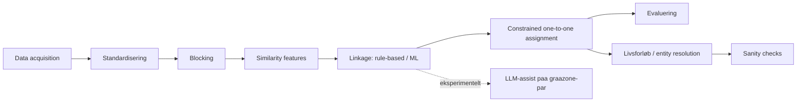

# historical-record-linkage-lab

Et selvstændigt data science-portfolio-projekt i historisk record
linkage: standardisering, blocking, similarity-features, regelbaseret og
ML-baseret kobling, one-to-one constrained assignment, benchmark-
evaluering, rekonstruktion af livsforløb/entiteter, systematiske sanity
checks og et eksperimentelt LLM-supplement - demonstreret på både et
kontrolleret syntetisk datasæt og et ægte, historisk OCR'et datasæt.

**Dette er et selvstændigt lærings- og portfolio-projekt.** Det er
**ikke** udviklet af eller for Rigsarkivet, bruger **ingen** HisPeR-data,
og hverken repræsenterer eller hævder professionel erfaring med record
linkage i produktionsskala, Snakemake på HPC, eller graph neural
networks. Se [docs/limitations.md](docs/limitations.md) for en fuld liste
over metodiske begrænsninger.

## 1. Formål

Projektet demonstrerer, at kompetencer inden for Python, datarensning,
feature engineering, ML-evaluering og reproducerbare workflows kan
overføres til historisk record linkage: kobling af heterogene, støjfyldte
kilder, konstruktion af forløb over tid, og systematisk evaluering af
metodekvalitet - fremfor blot at "få et resultat". Det er bygget som
forberedelse til en Data Scientist-ansøgning i et team, der arbejder med
storskala-kobling af historiske persondata, men er hverken tilknyttet
eller baseret på det teams faktiske data eller kode.

## 2. Problemstillingen

Givet flere heterogene, transskriberede kilder, der hver især beskriver
en delmængde af en population på forskellige tidspunkter: hvordan
afgører man, hvornår to poster fra forskellige (eller samme) kilder
beskriver samme virkelige person, og hvordan aggregerer man accepterede
links til sammenhængende forløb uden at overdrive sikkerheden i en
grundlæggende probabilistisk beslutning?

## 3. Hvorfor historisk record linkage er svært

- **Ingen stabil identifikator.** Der er intet CPR-nummer at slå op på -
  kun navn, alder/år, sted og (i visse kilder) erhverv/adresse, alle
  udsat for transskriptions- og stavevariation.
- **Almindelige navne kolliderer.** Et konkret, empirisk fund i dette
  projekts egne data: samme (efternavn, fornavn)-kombination kan optræde
  10+ gange for helt forskellige personer i én enkelt kilde (se afsnit 5).
- **Blocking er en afvejning, ikke en genvej.** At undgå at sammenligne
  alle poster med alle andre koster recall - nogle sande matches
  overlever aldrig blocking-trinnet, uanset hvor god selve
  linkage-metoden er.
- **Uafhængig par-klassifikation kan give modstridende links.** Uden en
  eksplicit begrænsning kan én post accepteres som match til flere andre
  poster samtidig - noget der aldrig kan være rigtigt, hvis hver post kun
  kan tilhøre én virkelig person.
- **Fejl forplanter sig.** En forkert pairwise-kobling bliver ikke
  mindre forkert af at blive aggregeret til et "livsforløb" - den bliver
  bare sværere at få øje på.

## 4. Arkitektur/pipeline



Denne pipeline er implementeret **to gange** med delt kernelogik hvor
det giver mening (`constrained_assignment.py`, similaritetsmønstre) og
separat, skemaspecifik logik hvor datasættene reelt er forskellige
(fødselsår+fødested vs. erhverv+adresse):

- `src/linkage_lab/` - det syntetiske benchmark (census + kirkebog).
- `src/linkage_lab/nyc_directories/` - det ægte case-datasæt (NYC city
  directory 1851/52).

## 5. Datasæt

### 5.1 Syntetisk benchmark

Genereret af `linkage_lab/data_generation.py` med en fast seed
(reproducerbart): en skjult "grundsandhed"-population på 4.000 individer,
en **census** (75 % dækning, ~3.000 poster, år 1850: fornavn, efternavn,
alder, fødested, bopæl, erhverv) og en **kirkebog** (75 % dækning, ~3.000
poster: fornavn, efternavn, fødselsår, fødested, sogn). Hver kilde er
støjet uafhængigt (stavevarianter, transskriptionsfejl, manglende felter,
lejlighedsvise store "brølere"). Ingen af kilderne dækker hele
populationen, og de overlapper kun delvist.

### 5.2 Real-world case study: NYC City Directory, 1851/52

Ægte OCR'et tekst fra Doggett's New York City Directory, 1851/52, hentet
fra NYPL's egen officielle GitHub-organisation
(`nypl-spacetime/city-directory-entry-parser`, MIT-licens) - se
`data/raw/nyc_directories/PROVENANCE.md` for fuld kildedokumentation og
[docs/dataset_selection_notes.md](docs/dataset_selection_notes.md) for
hvorfor dette datasæt blev valgt frem for et tidligere undersøgt
alternativ (NYPL's portrætmetadata, som viste sig uegnet - se samme
dokument).

**Vigtigt:** Dette repositorys udviklingsmiljø har kun netværksadgang til
GitHub og pakke-registre - direkte adgang til `digitalcollections.nypl.org`,
`archive.org`, `hathitrust.org` og `loc.gov` er blokeret (verificeret
empirisk). Derfor er kun **én årgang** tilgængelig som frit OCR-udtræk
uden API-nøgle, og datasættet demonstrerer entity resolution **inden for
én kilde** (samme person kan optræde mere end én gang i samme årgang),
ikke livsforløb på tværs af årgange - det sidste forbliver demonstreret
på det syntetiske datasæt, hvor det faktisk er understøttet af data. Se
[docs/limitations.md](docs/limitations.md).

Data parses med NYPL's egen offentliggjorte CRF-baserede parser
(vendored i `nyc_directories/_nypl_cdparser/`, trænet på NYPL's 70
håndlabelede eksempler) til et udsnit på **8.000 records** (de første
8.000 ikke-tomme linjer af kildens 87.674 linjer - et bevidst afgrænset,
håndterbart udsnit, ikke hele årgangen).

## 6. Standardisering

Fælles princip i begge pipelines: normaliser store/små bogstaver og
diakritiske tegn, men fjern **ikke** information, der kan være nyttig til
linkage (cifre i adresser, mellemrum mellem flerordede felter).

- **Syntetisk:** stednavne standardiseres via et lille gazetteer
  (synonymkatalog); efternavne kanoniseres bevidst *ikke* mod en
  facitliste, så similaritets-/ML-trinnet reelt skal håndtere
  stavevariation (se afsnit 15).
- **NYC directories:** en specifik, dokumenteret OCR-fejl rettes
  eksplicit (`fix_split_first_letter`: "J ames" → "James", 6,2 % af
  fornavnene i udsnittet). Erhverv kanoniseres mod en IPUMS-baseret
  historisk erhvervsordliste med Jaro-Winkler-similaritet - men **kun**
  når den bedste kandidat deler de første tre tegn med den observerede
  streng, fordi en ren similaritets-tærskel alene accepterer forkerte
  match (empirisk fundet eksempel: "widow" ↔ "window" scorer 0,956 uden
  dette filter).

## 7. Blocking / candidate generation

| | Blocking-nøgle | Records | Kandidatpar | Reduktion | Blocking recall |
|---|---|---:|---:|---:|---:|
| Syntetisk | Soundex(efternavn) + fødselsårs-bucket (±1) | ~3.000 × ~3.000 | 122.766 | - | 86,2 % (mod skjult facit) |
| NYC directories | Soundex(efternavn) + fornavns-forbogstav | 8.000 | 41.393 | 99,87 % | ikke direkte målbart (se nedenfor) |

For NYC directories kan ægte blocking recall ikke måles direkte: det
manuelle benchmark blev udtrukket **fra** kandidatparrene efter blocking,
så recall derpå ville være tautologisk 100 %. I stedet rapporteres en
billig proxy: 3 grupper af records, der deler fornavn, erhverv OG
adresse, men ville havne i forskellige blocke pga. uenig
efternavns-Soundex (typisk en OCR-fejl i selve efternavnet) - se
`results/reports/nyc_directories/data_quality_report.md`.

## 8. Similarity features

| Feature | Syntetisk | NYC directories | Hvorfor |
|---|:---:|:---:|---|
| Jaro-Winkler, fornavn | ✓ | ✓ | Håndterer stavevarianter uden at kræve eksakt match |
| Exact match, fornavn/efternavn | ✓ | ✓ | Stærkt signal når det er til stede |
| Fødselsårsdifference | ✓ | - | Kun relevant hvor alder/fødselsår findes |
| Fødested-match (+ "begge observeret") | ✓ | - | Undgår at tolke manglende data som uoverensstemmelse |
| Erhverv: Jaro-Winkler + exact (kanoniseret) | - | ✓ | Erhverv er et kernefelt i city directories, ikke i census/kirkebog-parret her |
| Adresse: Jaro-Winkler (business/hjem + kryds-match) | - | ✓ | Samme person kan have adressen registreret i forskellige roller på tværs af poster |

En bevidst udeladt feature i begge pipelines: en "efternavn/initial
matcher"-feature, fordi blocking allerede kræver dette - inden for
kandidatparrene ville featuren være konstant og uden diskriminerende
værdi (bekræftet empirisk i den syntetiske pipelines feature-importance,
se afsnit 11).

## 9. Linkage-metoder

Begge pipelines benchmarker mindst:

- **A. Regelbaseret / vægtet:** faste similaritets-tærskler, ingen
  træning, gennemsigtig og let at forklare.
- **B. ML (Random Forest):** trænet på featurene ovenfor.
- **C. Constrained matching:** se afsnit 10 - en forbedring oven på B,
  ikke en tredje uafhængig model.

Entity-level train/test-split bruges på det syntetiske datasæt (et
individs poster ligger udelukkende i træning eller test - se
`benchmark.py`). På NYC directories-benchmarket (kun 92 manuelt
labelede par, se afsnit 15) bruges i stedet en klasse-stratificeret
par-niveau-split, fordi der ikke findes et rent entity-id at splitte på
for rigtige personer, og datamængden er for lille til at ofre yderligere
til et strengere split - en dokumenteret forskel, ikke en forglemmelse.

## 10. Constrained assignment (one-to-one)

Uafhængig par-klassifikation kan acceptere flere links til samme record.
Dette løses generisk (`src/linkage_lab/constrained_assignment.py`) med
maximum-weight matching (`networkx.max_weight_matching`, virker på
generelle grafer - ikke kun bipartite - så samme modul bruges til begge
pipelines: census/kirkebog er bipartit, NYC directories er "inden for én
kilde" og altså ikke bipartit).

**Effekt på det syntetiske datasæt** (ML-metoden, alle splits):

| | Precision | Recall | F1 | Accepterede par |
|---|---:|---:|---:|---:|
| Før constraint | 0,470 | 0,996 | 0,639 | 4.113 |
| Efter constraint | 0,836 | 0,924 | 0,878 | 2.145 |

Constraint kan kun fjerne par (aldrig tilføje nye), så recall kan ikke
stige - men ved at beholde det højest-scorende link pr. record og droppe
konkurrerende, lavere-scorende par stiger precision markant, fordi mange
af de droppede par var false positives. Konflikter (records med >1
accepteret link) går fra 2.315 til 0.

**Effekt på NYC directories** (ML-metoden, hele korpus af 41.393
kandidatpar): 1.532 accepterede par, 608 records med konflikt før
constraint, 775 par tilbage efter (757 droppet), 0 konflikter tilbage.

Se `results/reports/constrained_assignment.md` og
`results/reports/nyc_directories/constrained_assignment.md`.

## 11. Evaluering

**Syntetisk (testsplit, n = 11.804 par, 569 sande matches):**

| Metode | Precision | Recall | F1 | TP | FP | FN | TN |
|---|---:|---:|---:|---:|---:|---:|---:|
| Regelbaseret | 0,994 | 0,566 | 0,721 | 322 | 2 | 247 | 11.233 |
| ML (Random Forest) | 0,737 | 0,991 | 0,846 | 564 | 201 | 5 | 11.034 |

**NYC directories (test-split af det manuelle benchmark, n = 37 par):**

| Metode | Precision | Recall | F1 | TP | FP | FN | TN |
|---|---:|---:|---:|---:|---:|---:|---:|
| Regelbaseret | 0,833 | 0,833 | 0,833 | 5 | 1 | 1 | 30 |
| ML (Random Forest) | 0,750 | 1,000 | 0,857 | 6 | 2 | 0 | 29 |

(NYC-tallene bygger på et lille, 92-par manuelt benchmark - se afsnit 15
for usikkerhed. De skal læses som en indikation, ikke en præcis
performance-måling.)

**Feature importance (syntetisk ML-model):** fornavns-similaritet
dominerer klart; efternavns-similaritet bidrager næsten intet, fordi
blocking allerede sker på efternavns-soundex (se afsnit 8).

**Trussel-behaviour:** `results/reports/nyc_directories/threshold_behaviour.csv`
viser precision/recall ved klassifikationstærskler 0,3-0,8 på ML-modellen.

### Fejlanalyse: hvorfor false positives er særligt problematiske her

Begge datasæt viser samme mønster: den mere permissive metode (ML) har
lavere precision end den regelbaserede metode. Det er ikke bare et tal -
det har en konkret nedstrøms-konsekvens. Når pairwise-links aggregeres
til livsforløb/entiteter (afsnit 12), bliver hver false positive-link en
kant i en graf. Hvis en post fejlagtigt linkes til to forskellige andre
poster, opstår en komponent med >2 knuder ("multi_match") - et livsforløb,
der påstår at forbinde poster, der reelt beskriver forskellige personer.
Dette er direkte målt i dette projekt: den syntetiske pipelines ML-metode
(uden constraint) har 49,3 % af sine livsforløb flagget, mod 3,0 % for
den regelbaserede metode - næsten udelukkende drevet af multi_match (se
afsnit 12). En false positive er altså ikke isoleret til én forkert
prædiktion; den forplanter sig til at gøre en hel rekonstrueret entitets
struktur upålidelig.

## 12. Livsforløb / entity resolution

**Syntetisk (`life_course.py`):** accepterede par aggregeres til en graf;
sammenhængende komponenter er "livsforløb", sporbare til de oprindelige
census-/kirkebogs-poster.

| Metode | Livsforløb | Markeret | Andel |
|---|---:|---:|---:|
| Regelbaseret | 1.132 | 34 | 3,0 % |
| ML, uden constraint | 1.456 | 718 | 49,3 % |
| ML, med one-to-one constraint | 2.145 | 81 | 3,8 % |

Constraint fjerner **alle** multi_match-konflikter per konstruktion (de
er netop det, one-to-one-begrænsningen forhindrer), men retter ikke
individuelt forkerte par - deraf det lille residuale antal flag.

**NYC directories (`entity_resolution.py`):** samme grafprincip, men
kaldt "entity resolution", **ikke** "livsforløb" - der er kun én årgang,
så der er ingen tidsdimension at rekonstruere et forløb over (se afsnit
5.2). Output er sporbart til de oprindelige OCR-linjer og markerer
altid identiteten som probabilistisk, aldrig sikker.

| Metode | Entiteter | Markeret | Andel |
|---|---:|---:|---:|
| Regelbaseret | 234 | 42 | 17,9 % |
| ML, uden constraint | 572 | 189 | 33,0 % |
| ML, med one-to-one constraint | 775 | 73 | 9,4 % |

Samme mønster som på det syntetiske datasæt: constraint fjerner alle
`multi_match`-flag (151 → 0), men det resterende `conflicting_occupation`
(73 tilfælde, uændret af constraint) er par, der individuelt blev
accepteret forkert - noget constraint per definition ikke retter, kun
one-to-one-strukturen omkring dem.

## 13. Sanity checks

| Check | Syntetisk | NYC directories |
|---|---|---|
| Mere end én post fra samme kilde i samme komponent (`multi_match`) | ✓ | ✓ |
| Modstridende fødselsårsestimater (>3 år) | ✓ | - |
| Fødselsår uden for plausibelt interval | ✓ | - |
| Stærkt modstridende erhverv (`conflicting_occupation`) | - | ✓ |
| Stærkt modstridende adresse (`conflicting_address`) | - | ✓ |
| Svag understøttelse (`weak_corroboration`: hverken erhverv eller adresse støtter linket) | - | ✓ |

Familie-/relationelle konflikt-checks er **ikke** implementeret - hverken
datasæt indeholder pålidelige familierelationsfelter, og at opfinde dem
ville modsige projektets eget krav om ikke at opfinde ground truth.

## 14. Eksperimentel LLM-linkage

`src/linkage_lab/llm_assist.py` implementerer et generisk,
skema-uafhængigt kald til en **lokal Ollama-server** (ikke en betalt
API) med strikt JSON-schema-validering
(`{"same_person": bool, "confidence": 0-1, "reasoning_summary": str}`).
`linkage_lab/linkage_llm.py` bruger det på den syntetiske pipelines
"gråzone"-par (ML `predicted_proba` mellem 0,35 og 0,65 - par den
almindelige model selv er mest usikker på).

**Kunne det køres her?** Nej - `ollama.com` og `registry.ollama.ai` er
blokeret af dette udviklingsmiljøs netværkspolitik (verificeret
empirisk), så hverken Ollama eller en model kunne installeres. Pipelinen
opdager dette (`llm_assist.is_ollama_available()`) og skriver en
placeholder-rapport i stedet for at fejle uforklaret eller opfinde et
resultat - se `results/reports/llm_experimental_supplement.md`. Kør det
selv med en lokal Ollama-installation:

```bash
ollama serve &
ollama pull llama3.2
snakemake --snakefile workflow/Snakefile --cores 1 llm_supplement
```

De deterministiske dele (JSON-parsing, schema-validering, fejlhåndtering
for forbindelsesfejl/timeout/ugyldigt output) er fuldt testet uden at
kræve Ollama (`tests/test_llm_assist.py`, `tests/test_linkage_llm.py`).

**Ærlig vurdering af metoden generelt** (uafhængigt af at den ikke kunne
køres her):

- **Non-determinisme:** samme par kan give forskelligt svar ved gentagne
  kald, medmindre temperature=0 og modellen selv er deterministisk -
  problematisk for et reproducerbart benchmark.
- **Hallucination:** en LLM kan producere en overbevisende `reasoning_summary`,
  der ikke reelt afspejler en korrekt vurdering.
- **Reproducerbarhed:** afhænger af model-version, ikke kun kode - en
  Ollama-model opdateret på brugerens maskine kan ændre resultatet uden
  en kodeændring.
- **Latency:** milliseconds (Random Forest) vs. sekunder pr. par (LLM) -
  uegnet til hele kandidatmængden, kun til en lille gråzone.
- **Kalibrering:** der er intet der garanterer, at en rapporteret
  `confidence=0.8` faktisk betyder 80 % korrekt over mange par - det
  kræver egen kalibrering mod et benchmark.
- **Privacy:** en lokal Ollama-model sender ikke data til en ekstern
  tjeneste - en reel fordel over en cloud-API for følsomme persondata,
  og en direkte begrundelse for at foretrække den her.
- **Beregningsomkostning:** lav (lokal CPU/GPU, ingen API-betaling), men
  ikke gratis i tid, hvis den bruges bredt.
- **Hvornår giver det værdi?** Potentielt på netop gråzone-par, hvor en
  tabel-baseret model er tættest på 50/50 - her kan fritekst-ræsonnement
  om stavevarianter og kontekst tilføre noget, tabel-features ikke
  fanger. Det er en hypotese, dette projekt ikke kunne teste empirisk i
  dette miljø.

## 15. Resultater

Se afsnit 10-13 ovenfor for de fulde resultater. Kort opsummeret:

- Regelbaseret linkage er konsekvent mere præcis, men fanger færre sande
  matches, på begge datasæt.
- One-to-one constrained assignment giver en stor, målt
  precision/F1-gevinst på begge datasæt, uden at kunne øge recall (det er
  matematisk umuligt for en post-hoc filtrering).
- Et manuelt 92-par benchmark for NYC directories (14 positive, 78
  negative - se `data/raw/nyc_directories/MANUAL_BENCHMARK.md`) viser, at
  ægte dubletter er **sjældne** i én enkelt directory-årgang: en ren
  tilfældig stikprøve på 80 kandidatpar gav kun ét klart positivt
  eksempel, så benchmarket måtte suppleres med en målrettet søgning efter
  stærk tværfelts-evidens for overhovedet at indeholde begge klasser.

## 16. Begrænsninger

Se [docs/limitations.md](docs/limitations.md) for den fulde, detaljerede
gennemgang, inklusive: synthetic-to-real gap, manglende/ufuldstændig
ground truth, OCR-fejl, kildebias, blocking-fejl, tærskel-følsomhed,
false-positive-forplantning, begrænsninger ved pairwise linkage,
usikkerhed i rekonstruerede entiteter, og LLM-begrænsninger.

## 17. Reproducerbarhed / installation

```bash
python3 -m venv .venv && source .venv/bin/activate
pip install -e ".[dev]"

# Kør hele pipelinen (syntetisk + NYC directories):
snakemake --snakefile workflow/Snakefile --cores 1

# Kør tests (kræver ikke Ollama, netværk eller nogen ekstern tjeneste):
pytest tests/ -v
```

NYC directories-data er **vendored** (committed direkte, ikke downloadet
ved kørsel) - se afsnit 5.2 og `data/raw/nyc_directories/PROVENANCE.md`
for hvorfor. Alle øvrige trin, for begge datasæt, er fuldt reproducerbare
fra denne ene kommando. Alle trin kan også køres enkeltvis, fx
`python -m linkage_lab.cli evaluate` eller
`python -m linkage_lab.nyc_directories.cli evaluate` - se `cli.py` i
begge pakker for den fulde liste af undertrin.

## 18. Projektstruktur

```
src/linkage_lab/                Syntetisk benchmark-pipeline
  data_generation.py              Syntetisk datagenerering
  reference_data.py                Navne-/stednavnepools og varianttabeller
  noise_model.py                    Transskriptionsstøj
  standardization.py                Normalisering + stednavnegazetteer
  blocking.py                        Soundex + fødselsårs-blocking
  features.py                        Pairwise similaritetsfeatures
  benchmark.py                       Labelling + entity-level train/test-split
  linkage_rule_based.py              Regelbaseret baseline
  linkage_ml.py                      Random Forest-klassifikator
  constrained_assignment.py          Generisk one-to-one assignment (delt)
  evaluation.py                      Metrics + fejl-eksempler
  life_course.py                     Grafaggregering + sanity checks
  llm_assist.py                      Generisk Ollama-klient (delt)
  linkage_llm.py                     LLM-supplement til det syntetiske datasæt
  visualize.py                       Statiske figurer
  cli.py                             Kommandolinje-indgange pr. pipeline-trin

  nyc_directories/                 Real-world case study
    _nypl_cdparser/                  Vendored NYPL CRF-parser (MIT)
    parsing.py                        Parsing + krydsvalidering
    data_acquisition.py               Indlæsning af vendored raw-data
    standardization.py                 OCR-fejlrettelse + erhvervskanonisering
    blocking.py                        Within-source blocking
    features.py                        Erhvervs-/adresse-/navnefeatures
    benchmark.py                       Manuelt benchmark + pair-split
    linkage_rule_based.py              Regelbaseret baseline
    linkage_ml.py                      Random Forest-klassifikator
    entity_resolution.py               Grafaggregering + sanity checks
    data_quality.py                    Datakvalitetsrapport
    evaluation.py                      Fejl-eksempler
    cli.py                             Kommandolinje-indgange pr. pipeline-trin

workflow/Snakefile               Reproducerbar pipeline (begge datasæt)
tests/                           pytest-tests af al kernelogik
docs/limitations.md              Metodiske begrænsninger (dansk)
docs/dataset_selection_notes.md  Hvorfor NYC directories blev valgt
results/                         Committede rapporter og figurer
data/raw/nyc_directories/        Vendored kildedata + provenance + manuelt benchmark
data/                            Øvrigt genereres af pipelinen (ikke committed)
```

## 19. Future work

- Udvide NYC directories-casen til flere årgange, hvis/når adgang til
  `digitalcollections.nypl.org` eller Internet Archive bliver muligt fra
  udviklingsmiljøet, for at kunne genindføre reel livsforløbs-
  rekonstruktion på tværs af tid på rigtige data.
- Erstatte det lille, single-annotator manuelle benchmark for NYC
  directories med et større, gerne dobbelt-annoteret datasæt.
- Faktisk køre og kalibrere LLM-supplementet mod det syntetiske og
  NYC-benchmarket, når en Ollama-installation er tilgængelig.
- Undersøge graf-baserede/GNN-metoder til life-course-konstruktion, som
  nævnt i det oprindelige HisPeR-brief - bevidst udeladt her for at
  undgå at tilføje kompleksitet uden empirisk begrundelse (se
  [docs/limitations.md](docs/limitations.md)).
