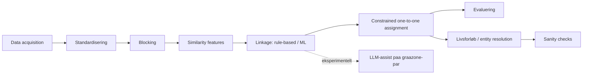

# Arkitektur og metodik

Denne side uddyber README's korte pipeline-oversigt. Se
[results.md](results.md) for detaljerede resultattabeller og fejlanalyse,
og [limitations.md](limitations.md) for metodiske begrænsninger.

## Problemstillingen

Givet flere heterogene, transskriberede kilder, der hver især beskriver
en delmængde af en population på forskellige tidspunkter: hvordan
afgører man, hvornår to poster fra forskellige (eller samme) kilder
beskriver samme virkelige person, og hvordan aggregerer man accepterede
links til sammenhængende forløb uden at overdrive sikkerheden i en
grundlæggende probabilistisk beslutning?

## Hvorfor historisk record linkage er svært

- **Ingen stabil identifikator.** Der er intet CPR-nummer at slå op på -
  kun navn, alder/år, sted og (i visse kilder) erhverv/adresse, alle
  udsat for transskriptions- og stavevariation.
- **Almindelige navne kolliderer.** Samme (efternavn, fornavn)-kombination
  kan optræde 10+ gange for helt forskellige personer i én enkelt kilde
  (empirisk fund i NYC-datasættet, se `results/reports/nyc_directories/data_quality_report.md`).
- **Blocking er en afvejning, ikke en genvej.** At undgå at sammenligne
  alle poster med alle andre koster recall - nogle sande matches
  overlever aldrig blocking-trinnet.
- **Uafhængig par-klassifikation kan give modstridende links.** Uden en
  eksplicit begrænsning kan én post accepteres som match til flere andre
  poster samtidig.
- **Fejl forplanter sig.** En forkert pairwise-kobling bliver ikke mindre
  forkert af at blive aggregeret til et "livsforløb" - den bliver bare
  sværere at få øje på (se [results.md](results.md)).

## Arkitektur



Pipelinen er implementeret **to gange** med delt kernelogik hvor det
giver mening (`constrained_assignment.py`, similaritetsmønstre) og
separat, skemaspecifik logik hvor datasættene reelt er forskellige
(fødselsår+fødested vs. erhverv+adresse):

- `src/linkage_lab/` - det syntetiske benchmark (census + kirkebog).
- `src/linkage_lab/nyc_directories/` - det ægte case-datasæt.

## Datasæt i detaljer

**Syntetisk benchmark:** genereret af `linkage_lab/data_generation.py`
med en fast seed. Skjult "grundsandhed"-population på 4.000 individer, en
**census** (75 % dækning, ~3.000 poster, år 1850: fornavn, efternavn,
alder, fødested, bopæl, erhverv) og en **kirkebog** (75 % dækning, ~3.000
poster: fornavn, efternavn, fødselsår, fødested, sogn). Hver kilde er
støjet uafhængigt (stavevarianter, transskriptionsfejl, manglende felter,
lejlighedsvise store "brølere"). Kilderne overlapper kun delvist.

**NYC City Directory, 1851/52:** ægte OCR'et tekst fra Doggett's New York
City Directory, hentet fra NYPL's officielle GitHub
(`nypl-spacetime/city-directory-entry-parser`, MIT-licens) - se
`data/raw/nyc_directories/PROVENANCE.md`. Dette udviklingsmiljø har kun
netværksadgang til GitHub og pakke-registre - direkte adgang til
`digitalcollections.nypl.org`, `archive.org`, `hathitrust.org` og
`loc.gov` er blokeret (verificeret empirisk). Derfor er kun **én årgang**
tilgængelig som frit OCR-udtræk uden API-nøgle, og datasættet
demonstrerer entity resolution **inden for én kilde**, ikke livsforløb på
tværs af årgange. Se [dataset_selection_notes.md](dataset_selection_notes.md)
for hvorfor dette datasæt blev valgt frem for et tidligere undersøgt
alternativ (NYPL's portrætmetadata, som viste sig uegnet).

Data parses med NYPL's egen offentliggjorte CRF-baserede parser (vendored
i `nyc_directories/_nypl_cdparser/`, trænet på NYPL's 70 håndlabelede
eksempler, krydsvalideret token-F1 = 0,980) til et udsnit på **8.000
records** (de første 8.000 ikke-tomme linjer af kildens 87.674 linjer).

## Standardisering

Fælles princip: normaliser store/små bogstaver og diakritiske tegn, men
fjern **ikke** information, der kan være nyttig til linkage (cifre i
adresser, mellemrum mellem flerordede felter).

- **Syntetisk:** stednavne standardiseres via et lille gazetteer
  (synonymkatalog); efternavne kanoniseres bevidst *ikke* mod en
  facitliste, så similaritets-/ML-trinnet reelt skal håndtere
  stavevariation.
- **NYC directories:** en specifik, dokumenteret OCR-fejl rettes
  eksplicit (`fix_split_first_letter`: "J ames" → "James", 6,2 % af
  fornavnene i udsnittet). Erhverv kanoniseres mod en IPUMS-baseret
  historisk erhvervsordliste med Jaro-Winkler-similaritet - men **kun**
  når den bedste kandidat deler de første tre tegn med den observerede
  streng, fordi en ren similaritets-tærskel accepterer forkerte match
  (empirisk fundet eksempel: "widow" ↔ "window" scorer 0,956 uden dette
  filter).

## Blocking / candidate generation

| | Blocking-nøgle | Records | Kandidatpar | Reduktion | Blocking recall |
|---|---|---:|---:|---:|---:|
| Syntetisk | Soundex(efternavn) + fødselsårs-bucket (±1) | ~3.000 × ~3.000 | 122.766 | - | 86,2 % (mod skjult facit) |
| NYC directories | Soundex(efternavn) + fornavns-forbogstav | 8.000 | 41.393 | 99,87 % | ikke direkte målbart |

For NYC directories kan ægte blocking recall ikke måles direkte: det
manuelle benchmark blev udtrukket **fra** kandidatparrene efter blocking,
så recall derpå ville være tautologisk 100 %. I stedet rapporteres en
proxy: 3 grupper af records, der deler fornavn, erhverv OG adresse, men
ville havne i forskellige blocke pga. uenig efternavns-Soundex - se
`results/reports/nyc_directories/data_quality_report.md`.

## Similarity features

| Feature | Syntetisk | NYC directories | Hvorfor |
|---|:---:|:---:|---|
| Jaro-Winkler, fornavn | ✓ | ✓ | Håndterer stavevarianter uden at kræve eksakt match |
| Exact match, fornavn/efternavn | ✓ | ✓ | Stærkt signal når det er til stede |
| Fødselsårsdifference | ✓ | - | Kun relevant hvor alder/fødselsår findes |
| Fødested-match (+ "begge observeret") | ✓ | - | Undgår at tolke manglende data som uoverensstemmelse |
| Erhverv: Jaro-Winkler + exact (kanoniseret) | - | ✓ | Kernefelt i city directories |
| Adresse: Jaro-Winkler (business/hjem + kryds-match) | - | ✓ | Samme person kan have adressen registreret i forskellige roller |

En bevidst udeladt feature i begge pipelines: en "efternavn/initial
matcher", fordi blocking allerede kræver dette - inden for kandidatparrene
ville featuren være konstant og uden diskriminerende værdi (bekræftet
empirisk i den syntetiske pipelines feature-importance, se
[results.md](results.md)).

## Linkage-metoder

Begge pipelines benchmarker mindst regelbaseret/vægtet linkage (faste
tærskler, ingen træning), ML (Random Forest, trænet på featurene ovenfor),
og constrained matching (se nedenfor - en forbedring oven på ML, ikke en
tredje uafhængig model).

Entity-level train/test-split bruges på det syntetiske datasæt (et
individs poster ligger udelukkende i træning eller test - se
`benchmark.py`). På NYC directories-benchmarket (kun 92 manuelt labelede
par) bruges i stedet en klasse-stratificeret par-niveau-split, fordi der
ikke findes et rent entity-id at splitte på for rigtige personer, og
datamængden er for lille til at ofre yderligere til et strengere split.

## Constrained assignment (one-to-one)

Uafhængig par-klassifikation kan acceptere flere links til samme record.
Dette løses generisk (`src/linkage_lab/constrained_assignment.py`) med
maximum-weight matching (`networkx.max_weight_matching`, virker på
generelle grafer - ikke kun bipartite - så samme modul bruges til begge
pipelines: census/kirkebog er bipartit, NYC directories er "inden for én
kilde" og altså ikke bipartit).

Constraint kan kun fjerne par (aldrig tilføje nye), så recall kan ikke
stige - men ved at beholde det højest-scorende link pr. record og droppe
konkurrerende, lavere-scorende par stiger precision markant, fordi mange
af de droppede par var false positives. Se [results.md](results.md) for
de fulde tal.

## Livsforløb / entity resolution

**Syntetisk (`life_course.py`):** accepterede par aggregeres til en graf;
sammenhængende komponenter er "livsforløb", sporbare til de oprindelige
census-/kirkebogs-poster.

**NYC directories (`entity_resolution.py`):** samme grafprincip, men
kaldt "entity resolution", **ikke** "livsforløb" - der er kun én årgang,
så der er ingen tidsdimension at rekonstruere et forløb over. Output er
sporbart til de oprindelige OCR-linjer og markerer altid identiteten som
probabilistisk, aldrig sikker.

## Sanity checks

| Check | Syntetisk | NYC directories |
|---|---|---|
| Mere end én post fra samme kilde i samme komponent (`multi_match`) | ✓ | ✓ |
| Modstridende fødselsårsestimater (>3 år) | ✓ | - |
| Fødselsår uden for plausibelt interval | ✓ | - |
| Stærkt modstridende erhverv (`conflicting_occupation`) | - | ✓ |
| Stærkt modstridende adresse (`conflicting_address`) | - | ✓ |
| Svag understøttelse (`weak_corroboration`) | - | ✓ |

Familie-/relationelle konflikt-checks er **ikke** implementeret - hverken
datasæt indeholder pålidelige familierelationsfelter, og at opfinde dem
ville modsige projektets eget krav om ikke at opfinde ground truth.

## Eksperimentel LLM-linkage

`src/linkage_lab/llm_assist.py` implementerer et generisk,
skema-uafhængigt kald til en **lokal Ollama-server** (ikke en betalt API)
med strikt JSON-schema-validering
(`{"same_person": bool, "confidence": 0-1, "reasoning_summary": str}`).
`linkage_lab/linkage_llm.py` bruger det på den syntetiske pipelines
"gråzone"-par (ML `predicted_proba` mellem 0,35 og 0,65).

**Kunne det køres her?** Nej - `ollama.com` og `registry.ollama.ai` er
blokeret af dette udviklingsmiljøs netværkspolitik (verificeret
empirisk), så hverken Ollama eller en model kunne installeres. Pipelinen
opdager dette (`llm_assist.is_ollama_available()`) og skriver en
placeholder-rapport i stedet for at fejle uforklaret eller opfinde et
resultat - se `results/reports/llm_experimental_supplement.md`. Kør det
selv med en lokal Ollama-installation:

```bash
ollama serve &
ollama pull llama3.2
snakemake --snakefile workflow/Snakefile --cores 1 llm_supplement
```

De deterministiske dele (JSON-parsing, schema-validering, fejlhåndtering
for forbindelsesfejl/timeout/ugyldigt output) er fuldt testet uden at
kræve Ollama (`tests/test_llm_assist.py`, `tests/test_linkage_llm.py`).

**Ærlig vurdering af metoden generelt** (uafhængigt af at den ikke kunne
køres her):

- **Non-determinisme:** samme par kan give forskelligt svar ved gentagne
  kald, medmindre temperature=0 og modellen selv er deterministisk.
- **Hallucination:** en LLM kan producere en overbevisende
  `reasoning_summary`, der ikke reelt afspejler en korrekt vurdering.
- **Reproducerbarhed:** afhænger af model-version, ikke kun kode.
- **Latency:** milliseconds (Random Forest) vs. sekunder pr. par (LLM) -
  uegnet til hele kandidatmængden, kun til en lille gråzone.
- **Kalibrering:** en rapporteret `confidence=0.8` er ikke garanteret at
  betyde 80 % korrekt over mange par uden egen kalibrering.
- **Privacy:** en lokal Ollama-model sender ikke data til en ekstern
  tjeneste - en reel fordel over en cloud-API for følsomme persondata.
- **Beregningsomkostning:** lav (lokal CPU/GPU, ingen API-betaling), men
  ikke gratis i tid, hvis den bruges bredt.
- **Hvornår giver det værdi?** Potentielt på netop gråzone-par, hvor en
  tabel-baseret model er tættest på 50/50 - en hypotese dette projekt
  ikke kunne teste empirisk i dette miljø.

## Future work

- Udvide NYC directories-casen til flere årgange, hvis/når adgang til
  `digitalcollections.nypl.org` eller Internet Archive bliver muligt, for
  at kunne genindføre reel livsforløbs-rekonstruktion på tværs af tid på
  rigtige data.
- Erstatte det lille, single-annotator manuelle benchmark for NYC
  directories med et større, gerne dobbelt-annoteret datasæt.
- Faktisk køre og kalibrere LLM-supplementet, når en Ollama-installation
  er tilgængelig.
- Undersøge graf-baserede/GNN-metoder til life-course-konstruktion -
  bevidst udeladt her for at undgå at tilføje kompleksitet uden empirisk
  begrundelse (se [limitations.md](limitations.md)).
